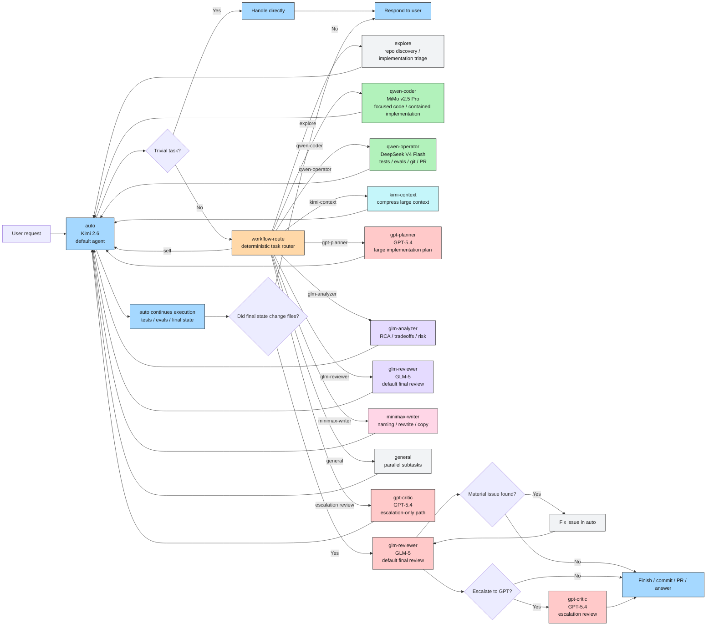

# OpenCode Workflow Diagram

Mermaid version of the workflow.

This is the canonical visual explanation of the setup.

## Main Diagram

## Reading Guide

- The user talks only to `auto`.
- `auto` handles simple work directly.
- `workflow-route` decides which specialist to call for non-trivial work.
- Implementation work with unclear scope goes through `explore` first so sizing comes from repo evidence, not wording alone.
- Large implementation work can go through `kimi-context` and `gpt-planner` before code execution starts.
- Specialists return control back to `auto`.
- If the final state changed files, `glm-reviewer` reviews the completed result first.
- `gpt-critic` is used only when escalation is needed.

## Core Message

Open models do almost all of the work.

GLM does the default final review on completed changed work.
GPT is reserved for escalation only.
